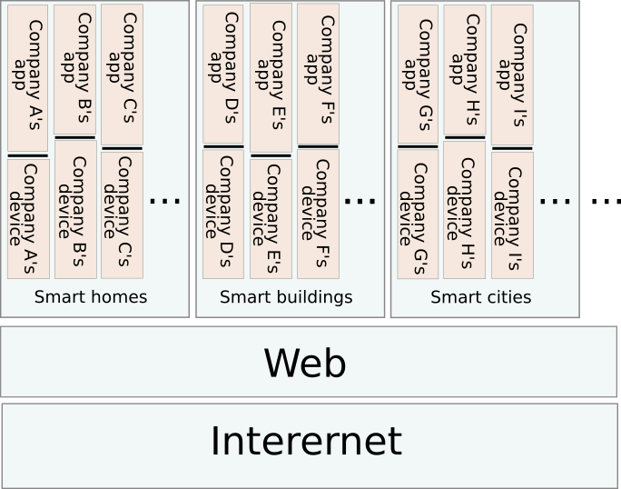
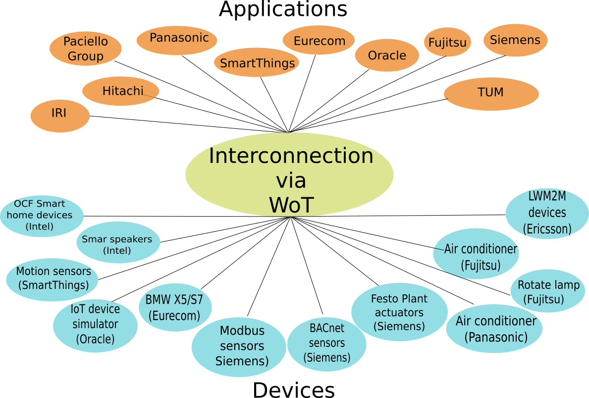
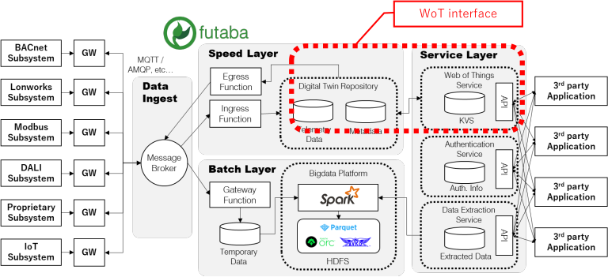
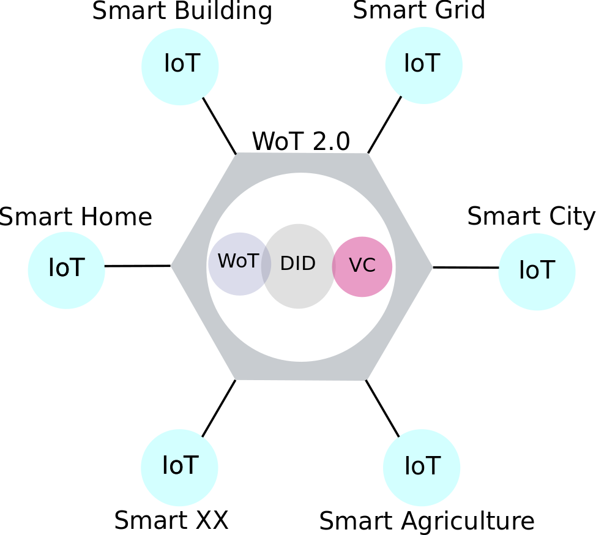

# Smart Cities Updates

## Background and Motivation
"Smart Cities" refers to a range of technologies and processes for intelligent management of our built and inhabited environment. As interest rises, we see prospects for smarter and easier integration of various technologies from multiple vendors related to IoT devices and Web services.

Several preliminary use cases [1] on Smart Cities have been discussed within the Web of Thing (WoT) IG as part of the WoT standardization based on the proposal during the Second WoT Workshop in Munich [2].

However, Smart Cities include various technologies, of which WoT is just one. So W3C organized a virtual online workshop on Smart Cities in June 2021 to finalize this Charter for the Smart Cities Interest Group to collect input from the Smart Cities stakeholders.

During the workshop discussion, we did the following:
* Identified Smart Cities standardization stakeholders to drive the development of Web standards aligned with the real needs of Smart Cities
* Clarified reasonable applications for Smart Cities technologies
* Saw how to improve the draft Charter for the potential Smart Cities Interest Group for further discussions within that IG
* We also confirmed that it would be very important to consider inclusive design including accessibility, privacy, security, and internationalization. Smart City applications are tightly related to the people who live in cities. We want Smart City technology to have a positive impact on their lives and want to avoid unintended negative consequences.

The goal of the group is not to generate standard itself, but to gather pain points, requirements and priorities for Web-based smart cities in the near future. So we need to figure out the focus that W3C can make the most impact. We don't want to duplicate work already done by the other SDOs.

## Problems to solve
Standards are essential for Smart City technology and business development. Standards benefit vendors, cities, and users. For vendors,standards unify markets and mean that a larger market can be addressed with a single product design, allowing products to more efficiently make returns on the investments needed to develop them. 

For cities, standards allow the deployment of technologies that can be sourced from multiple vendors, more and higher quality products, and increases the probability that systems will remain usable over a longer timescale. Standards also encourage the development of open systems that can interoperate with other standardized systems, multiplying the number of use cases that can be addressed. 

For users, standardized technologies mean that services available in one city will also be available in others, facilitating mobility.

However, we need to know what standards should be developed to achieve these objectives. What gaps exist? What opportunities can be exposed by standards that enable new use cases? What are the business drivers that encourage adoption of standards, and how can standard development be aligned with these drivers? Given a set of standards that could be developed, what are the priorities? How can the needs and goals of all stakeholders be aligned?

The purpose of this Interest Group is to collect and connect Smart City stakeholders to answer these kinds of questions and drive the development of Web technology standards aligned with the real needs of Smart Cities.

The topics that the Group will address include but are not limited to:
* Transportation, both public and private;
* Logistics, including last-mile delivery of goods and services;
* Infrastructure, including IoT-based sensing and actuation;
* Energy management and sustainability;
* Connection between climate crisis and smart cities;
* Relationship with Smart Buildings as part of the geolocation things like location of pipes;
* Signage, addressing the problem of timely delivery of information to a diverse population;
* Open data portals, including network APIs to data services and the development of app ecosystems;
* Data management, facilitating the rapid ingestion, storage, and dissemination of data
* Edge and cloud computing, allowing computation to be efficiently applied when and where needed;
* Payments, to allow services to be monetized, encouraging new business development and cost recovery;
* Privacy, to preserve the rights of citizens and other stakeholders;
* Security, to preserve the integrity and safety of systems and protect users;
* Accessibility, to incorporate design-for-all thinking throughout all aspects of smart city infrastructure, and ensure accessibility for people with disabilities in every activity and at every stage of life;
* Internationalization, to support diverse populations and tourism.

We can speculate about many topics, so we need to identify what the group's key topics are and see what would fit with W3C through the discussion with the existing smart cities.

The main tasks that the proposed Group will undertake include:
* Identification of stakeholders from the industries, countries/cities  and communities to involve in the group's discussion
* Survey on the existing technologies and standards for Smart Cities  (Technology Landscape)
* Best Practices on what technologies, e.g., WoT, Automotive,
* Geospatial, VR/AR, Speech and Semantic Web, to be applied for what kind of Smart Cities applications, e.g., improved accessibility,  visitor guidance and energy management.
* Smart Cities use cases to which Web technologies are applicable and requirements to provide better support for high priority use cases

The group should also consider the following when work on the above tasks:
* Identification and prioritization of gaps in Web standards for Smart
* City use cases; Incubation of technical solutions for the identified requirements by supporting the creation of Community Groups or Business
* Groups focusing on particular topics; Suggesting existing Working Groups to include particular topics in their scope as appropriate;
* Suggesting the creation of new Working Groups to address particular  topics if no existing Working Group is appropriate;
* Tracking and review of Smart City-related deliverables developed by other W3C groups, and reporting of issues as appropriate;
* Coordination with other organizations to gather knowledge, coordinate input into W3C efforts, and promote development and use of W3C  standards within Smart City applications;
* Ensuring issues of accessibility, device independence,  internationalization, performance, privacy, and security are given  equal consideration in all discussions and outcomes.

Accessibility is very important for smart cities because cities include many people potentially with disabilities. So we need to look for "missing data" within smart cities, i.e., data of those who might not be well-represented among the data-sets, to ensure that they are surely recognized and well-served by the smart cities. For that purpose, we need to consider people with multiple disabilities (intersectional considerations) and people with cognitive and learning disabilities too.

Note that there are many topics to discuss around Smart Cities and the scope of the group may become too broad, so we would like to focus on data governance and privacy management for the first year based on the discussion during the workshop.

## What has been done so far
### W3C Web of Things
IoT developers face the big problem of “IoT Silos” when creating an application including multiple services from different IoT platforms.

The W3C Web of Things (WoT) Working Group has been working on standards to counter the fragmentation of the IoT and enable easy integration of IoT devices and services across IoT platforms and application domains by providing a common description across different ecosystems (=WoT Thing Description), standards.

WoT standards are now being used for various industry areas including:

#### Smart home (collaboratively with ECHONET)
Improve the usability of home appliances for device users by allowing device users to configure the operation modes of all devices at home without configuring those devices one by one when they leave and come home.

(https://www.w3.org/TR/wot-usecases/images/wot-use-case-echonet.png)

#### Smart building (collaboratively with IPA DADC)
Integrate various sensor networks and various devices by WoT within a smart building which use different data models and protocols.

(https://www.w3.org/2022/Talks/0914-smartcities-ka/20220914-dt-sc-ka.pdf slide 18)

#### Smart factory (collaboratively with OPC via Siemens)
A bottling line consists of a filling module, a capping module, a labeling module, and a transport system. The production line is provided via an OPC UA endpoint for control and monitoring purposes.

(https://www.w3.org/TR/wot-usecases/images/industry-4.0.png)

### Related SDO's work
* IEC SC3D's Common Data Dictionary (CDD)
  * Defining common methodology and product ontology for various IoT purposes.
* ISO/IEC JTC1
  * Various standards on smart cities and digital twins, e.g., ISO/IEC 30146:2019
* ITU-T SG20
  * Standardization on IoT and Smart Cities from the ICT viewpoint, e.g., Data Processing and Management (FG-DPM)
* Open Geospatial Consortium (OGC)
  * Geospatial standards and tools around smart cities and digital twins
  * These days working on Digital Twins technology, e.g., Location powers urban digital twins

## What is still missing
During the discussions so far, there are strong needs for the followings:
* Guidelines for real-world engineering
  * Device discovery
* Inter-system binding
  * ID authentication and management
* Data transfer and distribution
  * Governance of data distribution - Security/Privacy
* Semantic interoperability - Standardized vocabulary
  * Catalog to start with the data search
* And also Accessibility, Geolocation, etc.

## “Digital Twins” as the Key Concept
During the discussions from:
* WoT standardization in general, e.g., the WoT Use Cases and the WoT Architecture:
  * WoT Use Cases
  * WoT Architecture
* Smart Cities Workshop in 2021
* TPAC breakout in 2022

All the participants were interested in “Digital Twins” as the key concept for the Smart Cities discussion. So we’d like to start with clarifying the use cases and requirements for “Digital Twins” first.

Please note there are various definitions for "Digital Twins" like the following, so we’ll work on the common definition for “Digital Twins” as well.
* Wikipedia:
  * A digital twin is a digital representation of an intended or actual real-world physical product, system, or process (a physical twin) that serves as the effectively indistinguishable digital counterpart of it for practical purposes, such as simulation, integration, testing, monitoring, and maintenance.
* WoT Architecture: 
  * A digital twin is a virtual representation of a device or a group of devices that resides on a cloud or edge node. It can be used to represent real-world devices which may not be continuously online, or to run simulations of new applications and services, before they get deployed to the real devices.

# Proposed Web-based Digital Twins for Smart Cities (Interest|Community) Group
We still need to work on discussion at W3C about (1) possible Web-based future framework for Digital Twins for Smart Cities and (2) standardized vocabulary for Smart Cities with the related SDOs collaboratively.

A possible candidate framework for that purpose, which was agreed by the participants in the WoT WG and the TPAC breakout, is based on the following W3C standards:
* Decentralized Identifiers (DID): define IDs to to identify devices and users
* Web of Things (WoT): define device capability
* Verifiable Credentials (VC): standardized description for user credentials

To continue the further discussion on the common Web-based platform and standardized vocabulary, we'd like to launch a dedicated group:
* to identify and document use cases and requirements that W3C specifications need to meet to support Smart City services,
* to obtain feedback from all stakeholders on the usage of Web technologies for Smart Cities,
* to gather expert input on important features for Smart Cities based on the Web technology, and to provide a forum for technical and business discussions related to Smart Cities.

[1] https://w3c.github.io/wot-usecases/#smart-city

[2] https://www.w3.org/WoT/ws-2019/minutes.html#day2-item02
